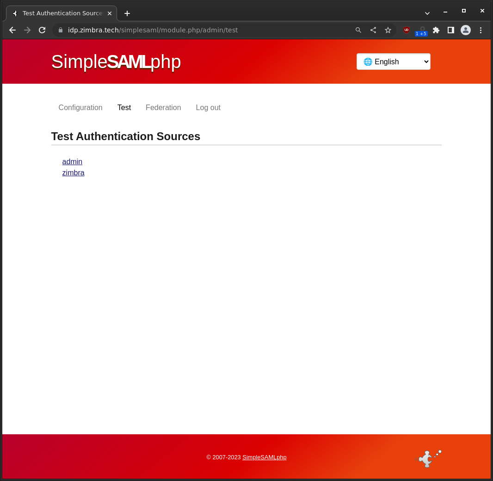
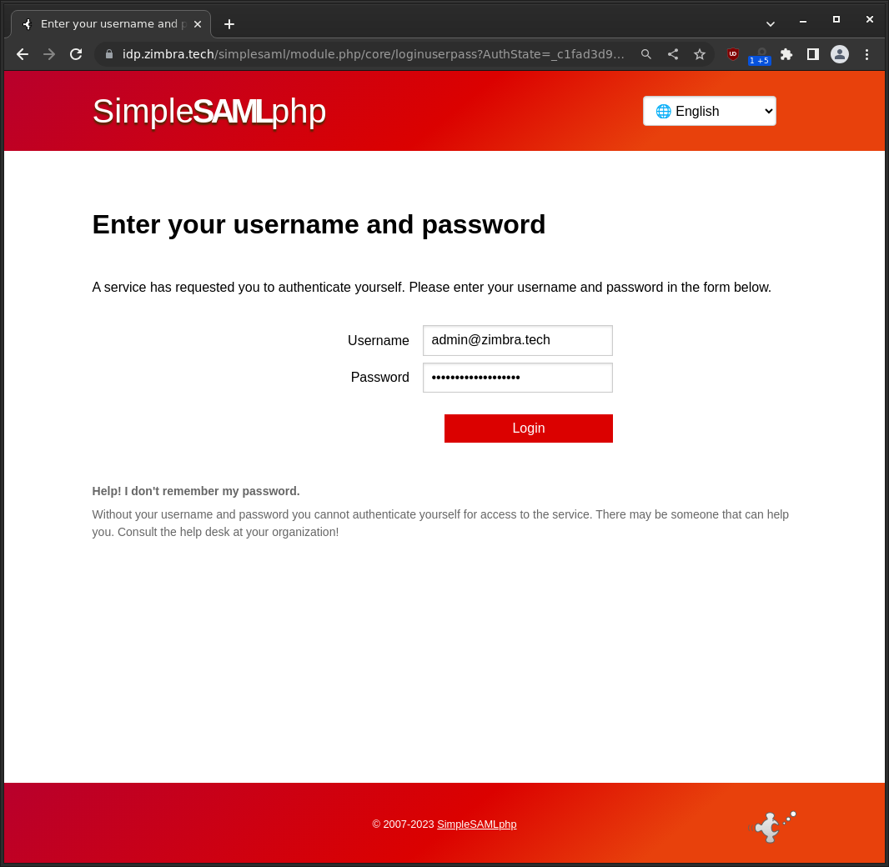
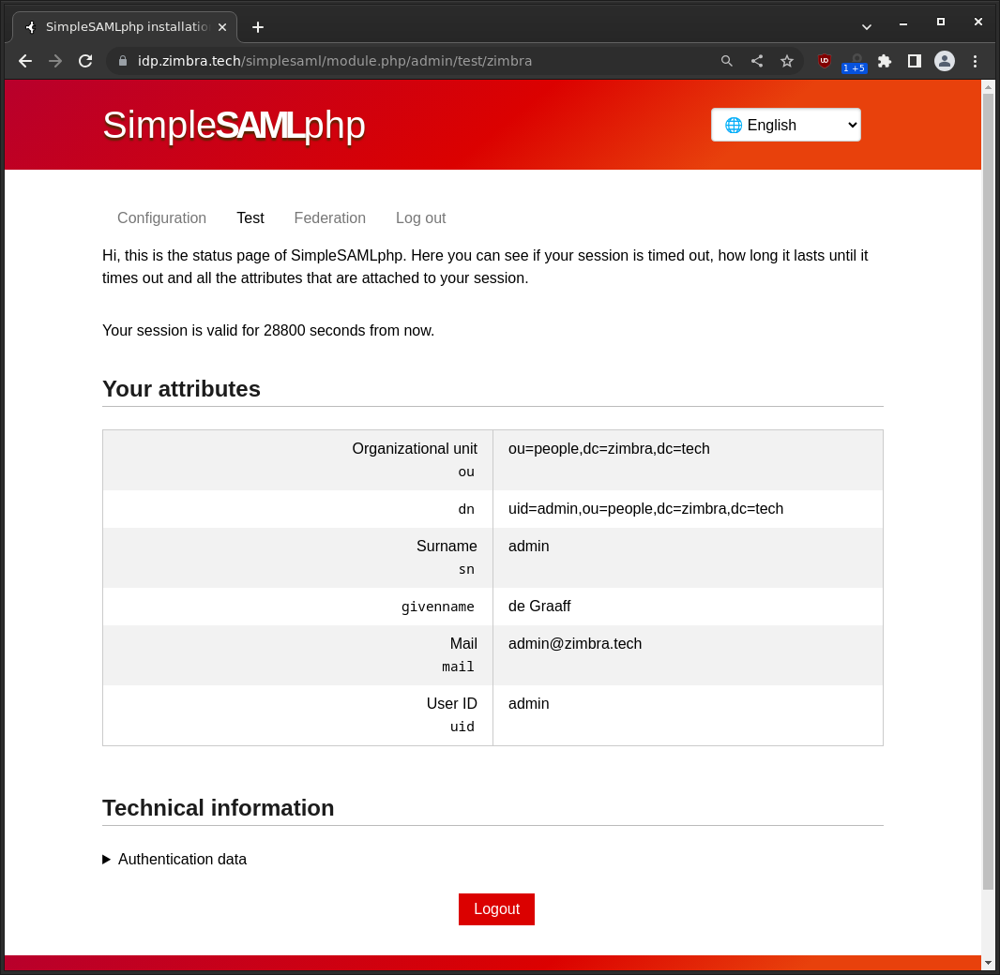
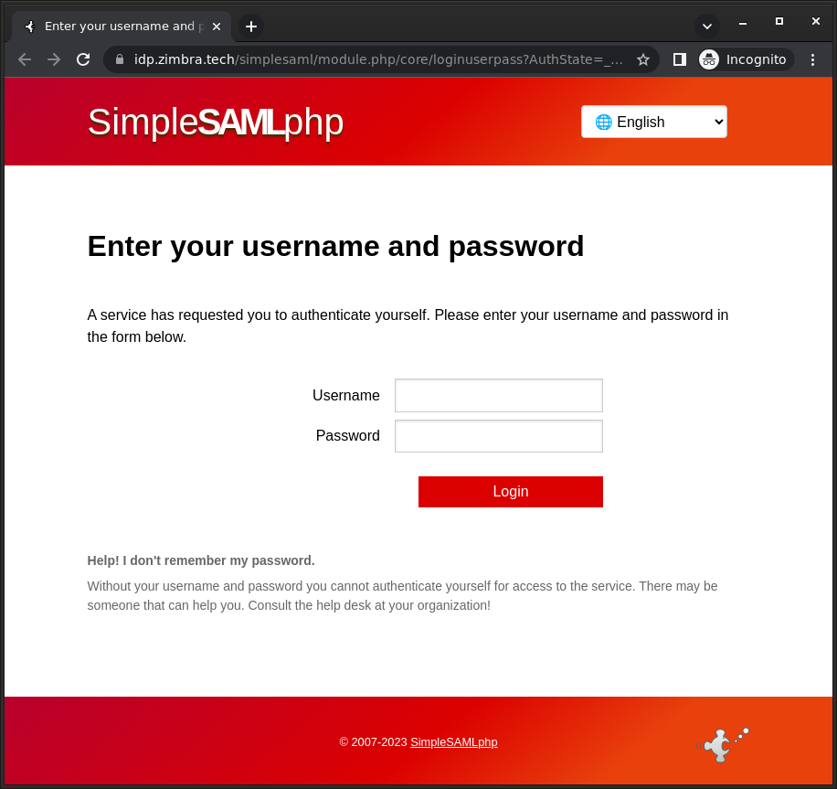

# Zimbra with on premise Single Sign-On using SimpleSAMLphp

SAML is an open standard for Single Sign-On. When using SAML an Identity Provider (IdP) will take care of user authentication after which users can use their applications without having to log-on to each of them separately. In SAML these applications are called Service Providers (SP). In this guide we will set-up  SimpleSAMLphp to act as SAML IdP. And we configure the IdP to use Zimbra's LDAP to validate the users. This way we add full SAML capabilities to Zimbra. 

## Setting up SimpleSAMLphp

SimpleSAMLphp needs to be installed on a server with Apache and PHP. You can follow the [install guide](https://simplesamlphp.org/docs/stable/simplesamlphp-install) to set it up. To be able to use the Zimbra LDAP from SimpleSAMLphp you will also need to install the [Zimbra authentication module for SimpleSAMLphp](https://github.com/Zimbra/zimbra-auth-module-simplesamlphp).

## Cookie setting in config.php

These settings have become mandatory since 2020 as of Google Chrome version 80.

    'session.cookie.secure' => true,
    'session.cookie.samesite' => 'None',

### Setting up Zimbra as the authentication source for SimpleSAMLphp

The Zimbra authentication module for SimpleSAMLphp makes it easy to use the Zimbra LDAP as the authentication source for your SimpleSAMLphp based SAML IDP.

1. The Zimbra authentication module requires users to use their full email address to log-in.
2. Login by the use of an alias email address is not and will not be supported.
3. This module requires TLS for the connection between this module and the Zimbra LDAP.
4. This module was designed for SimpleSAMLPhp version 2.0.4.

## 2FA
If you want to use 2FA this should be achieved with an additional SimpleSAMLPhp module. This module is not aware of Zimbra 2FA and it will ignore any Zimbra 2FA settings.

## Installing and configuration

Set-up in config/authsources.php as follows, replace `zimbraserver.example.com` with your Zimbra server hostname:

```
'zimbra' => array (
    'zimbraauth:ZimbraAuth',
    'zimbraServer' => 'zimbraserver.example.com',
    'zimbraPort' => 389
)
```

Enable the module in config/config.php, add zimbraauth to module.enable as following example:
```
     'module.enable' => [
           'admin' => true,
           'zimbraauth' => true,
     ],
```
First use the `cd` command to go into the installation folder of SimpleSAMLPhp, then install this module using:

```
mkdir -p modules/zimbraauth/src/Auth/Source/
wget https://raw.githubusercontent.com/Zimbra/zimbra-auth-module-simplesamlphp/main/ZimbraAuth.php -O modules/zimbraauth/src/Auth/Source/ZimbraAuth.php
chown www-data:www-data modules/ -R  #Ubuntu
chown apache:apache modules/ -R  #RedHat
```

Assuming you installed SimpleSAMLPhp in simplesaml Apache location, you can test the authentication source via: https://your-saml-server.example.com/simplesaml/module.php/admin/test/zimbra

First login using your SimpleSAMLPhp admin credentials and then use a Zimbra account for testing. Use the full Zimbra email address to log-in. (admin@example.com or testuser@example.com and NOT admin or testuser)

Upon successful auth the following attributes will be available: "ou", "sn", "givenname", "mail", "uid".

If this works you can set-up SimpleSAMLPhp as an IDP and use Zimbra as the authentication source see: https://simplesamlphp.org/docs/stable/simplesamlphp-idp.html

Bare minimum example of metadata/saml20-idp-hosted.php, notice 'auth'=>'zimbra' is what tells SimpleSAMLPhp to use the Zimbra authentication module:

```
<?php
$metadata['https://your-saml-server.example.com/simplesaml/saml2/idp/metadata.php'] = [
   'host' => '__DEFAULT__',
   'privatekey' => 'server.pem',
   'certificate' => 'server.crt',
   'auth' => 'zimbra',
];
```

## Test screenshots

Again you can test authentication at https://saml.example.com/simplesaml/module.php/admin/test/zimbra via the SimpleSAMLphp WebUI replace saml.example.com with your installation domain. You will be required to log-in using your SimpleSAMLPhp admin credentials, then you can enter a valid username and password from your Zimbra server LDAP to test user login.





## Set up Zimbra SP in SimpleSAMLphp

In SAML terms applications are called Service Providers or SP's. The service that provides your user database and takes care of your authentication is in SAML terms called Identity Provider or IDP. Usually you only have one IDP and as many SP's as you have applications. In this example we will set-up Zimbra as a SAML SP and use SimpleSAMLphp as IDP. This is the configuration needed on SimpleSAMLphp (in `/etc/simplesamlphp/metadata/saml20-sp-remote.php`):


```
$metadata['https://zimbra.example.com/service/extension/samlreceiver'] = array(
    'simplesaml.attributes'     => true,
       'debug' => TRUE,
        'AssertionConsumerService' => 'https://zimbra.example.com/service/extension/samlreceiver',
        'SingleLogoutService' => 'https://zimbra.example.com/service/extension/samlslo',
        'NameIDFormat' => 'urn:oasis:names:tc:SAML:1.1:nameid-format:emailAddress',
           'authproc' => array (
                   10 => array(
                 'class' => 'saml:AttributeNameID',
                 'identifyingAttribute' => 'mail',
                 'Format' => 'urn:oasis:names:tc:SAML:1.1:nameid-format:emailAddress',
              ),
           )
);
```

You will also need to get the X.509 public certificate that is used for signing the SAML request from th IDP to Zimbra. You will need to download it and save it on 
your Zimbra server. This guide will assume you store your cert in `/tmp/idpcert.pem`, don't forget to `chown zimbra:zimbra /tmp/idpcert.pem`. If you followed the SimpleSAMLphp setup guide you can find the certificate at `/etc/simplesamlphp/cert/server.crt`.

### Set up Zimbra

Create the config directory using:

```
mkdir -p /opt/zimbra/conf/saml
```

Add the file `/opt/zimbra/conf/saml/saml-config.properties` to configure SAML in Zimbra add the contents:

```
# Issuer
saml_sp_entity_id=https://zimbra.example.com/service/extension/samlreceiver
# Login receiver for the service provider
saml_acs=https://zimbra.example.com/service/extension/samlreceiver
# Name ID format for the IDP to use in the SAMLResponse
saml_name_id_format=urn:oasis:names:tc:SAML:1.1:nameid-format:emailAddress
# Date format for issue instant
saml_date_format_instant=yyyy-MM-dd'T'HH:mm:ss'Z'
# Identity provider login endpoint for redirect method
saml_redirect_login_destination=https://saml.example.com/simplesaml/saml2/idp/SSOService.php?spentityid=https://zimbra.example.com/service/extension/samlreceiver
# Identity provider login endpoint for POST method
saml_post_login_destination=
# Identity provider logout endpoint for redirect method
saml_redirect_logout_destination=https://saml.example.com/simplesaml/saml2/idp/SingleLogoutService.php
# Identity provider logout endpoint for POST method
saml_post_logout_destination=
# Logout redirect page if we are the landing page logout endpoint
saml_landing_logout_redirect_url=/
# Disable the audience path check
saml_skip_audience_restriction=true
# URL to send the user with error_code, error_msg query params. Default results in HTTP error code pages.
saml_error_redirect_url=
# The SAML logout document encoding, and SAML login receiver parameter encoding.
saml_document_encoding=ASCII
# Set to true to disable the audience path check.
saml_skip_audience_restriction=false
# The redirect location to send the user if their Zimbra account is not active.
saml_inactive_account_redirect_url
```

From the command line as user root copy the samlextn.jar and set up the IDP certificate like this:

```
mkdir /opt/zimbra/lib/ext/saml
cp /opt/zimbra/extensions-network-extra/saml/samlextn.jar /opt/zimbra/lib/ext/saml/
su zimbra
cat /tmp/idpcert.pem |xargs -0 zmprov md example.com zimbraMyoneloginSamlSigningCert
# zmprov mcf zimbraCsrfRefererCheckEnabled FALSE
zmprov mcf zimbraCsrfAllowedRefererHosts saml.example.com
# new since 9.0.0 patch 25 you are required to set zimbraVirtualHostName:
zmprov md example.com zimbraVirtualHostName zimbra.example.com
/opt/zimbra/bin/zmlocalconfig -e zimbra_same_site_cookie=""  #read below section!
zmmailboxdctl restart
```

### SameSite Cookie restriction and SAML

If your IDP and Zimbra are on the same domain in an on-premise deployment. For example zimbra.example.com and saml.example.com you can use SameSite cookie setting Strict:

```
/opt/zimbra/bin/zmlocalconfig -e zimbra_same_site_cookie="Strict"
zmmailboxdctl restart
```

If your IDP is under a different domain in a hosted SaaS IDP deployment. For example zimbra.example.com and saml.authprovider.org you probably have to disable the SameSite cookie setting as follows:

```
/opt/zimbra/bin/zmlocalconfig -e zimbra_same_site_cookie=""
zmmailboxdctl restart
```


### Single logout

If you want the IDP to log-out all applications when the user clicks logout in Zimbra you have to configure Zimbra to use this log-out url:

```
zmprov md example.com zimbraWebClientLogoutURL https://zimbra.example.com/service/extension/samllogout
#or globally
zmprov mcf zimbraWebClientLogoutURL https://zimbra.example.com/service/extension/samllogout
# new since 9.0.0 patch 25 you are required to set it via a local config also:
zmlocalconfig -e zimbra_web_client_logoff_urls=https://zimbra.example.com/service/extension/samllogout
```

It is possible to use multiple URL's in `zimbra_web_client_logoff_urls` by using space as a delimiter:

```
zmlocalconfig -e zimbra_web_client_logoff_urls="https://zimbra.com https://synacor.com"
```

### Create users

Your user accounts must be manually created in Zimbra and be available in your IDP user database. It is important that the E-mail attribute in your IDP is set exactly the same as the Zimbra account name. Or the user will not be able to log-in. If it does not work run a `tail -f /opt/zimbra/log/*` while doing the authentication request and dig through to log to find out what the issue may be. Keywords to grep for: SAML, Audience and assertion.

### Configurable Properties saml-config.properties

The samlextn.jar uses a property file located at: `${zimbra_home}/conf/saml/saml-config.properties`.

The following properties are supported:

| Key | Description | Default | Optional |
| --- | ----------- | ------- | -------- |
| saml_sp_entity_id | Issuer | | |
| saml_acs | Login receiver for the service provider | | |
| saml_redirect_login_destination | Identity provider login endpoint for redirect method | | |
| saml_redirect_logout_destination | Identity provider logout endpoint for redirect method | | |
| saml_post_login_destination | Identity provider login endpoint for POST method (unused) | | √ |
| saml_post_logout_destination | Identity provider logout endpoint for POST method (unused) | | √ |
| saml_name_id_format | Name ID format for the IDP to use in the SAMLResponse | `urn:oasis:names:tc:SAML:1.1:nameid-format:unspecified` | √ |
| saml_date_format_instant | Date format for issue instant | `yyyy-MM-dd'T'HH:mm:ss'Z'` | √ |
| saml_error_redirect_url | URL to send the user with `error_code`, `error_msg` query params. Default results in HTTP error code pages. | | √ |
| saml_landing_logout_redirect_url | Logout redirect landing page if we are the last logout service. | `/` | √ |
| saml_document_encoding | The SAML logout document encoding, and SAML login receiver parameter encoding. | `ASCII` | √ |
| saml_skip_audience_restriction | Set to true to disable the audience path check. | `false` | √ |
| saml_inactive_account_redirect_url | The redirect location to send the user if their Zimbra account is not active. | `/service/extension/samllogout` | √ |


Now you are ready to log-on to Zimbra using SAML. Try a fresh browser/incognito window and go to: https://saml.example.com/simplesaml/saml2/idp/SSOService.php?spentityid=https://zimbra.example.com/service/extension/samlreceiver



If all goes well, you should now be logged-on to Zimbra. You can change the default log-in page for Zimbra using

```
zmprov md example.com zimbraWebClientLoginURL https://saml.example.com/simplesaml/saml2/idp/SSOService.php?spentityid=https://zimbra.example.com/service/extension/samlreceiver
```

### Disable authentication fallback

By default Zimbra will also try to log-in using credentials from Zimbra LDAP, if you have SAML working, you should disable this fallback.

```
zmprov md example.com zimbraAuthFallbackToLocal FALSE   #replace example.com with your domain!
```

### Further reading

- https://simplesamlphp.org/docs/stable/simplesamlphp-theming
- https://github.com/Zimbra/zimbra-auth-module-simplesamlphp
